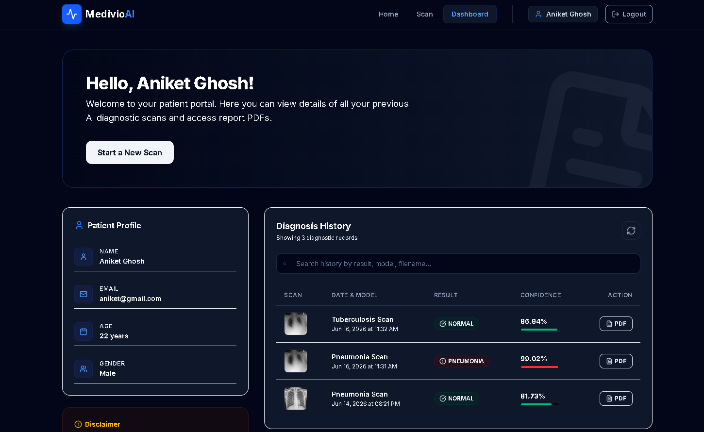
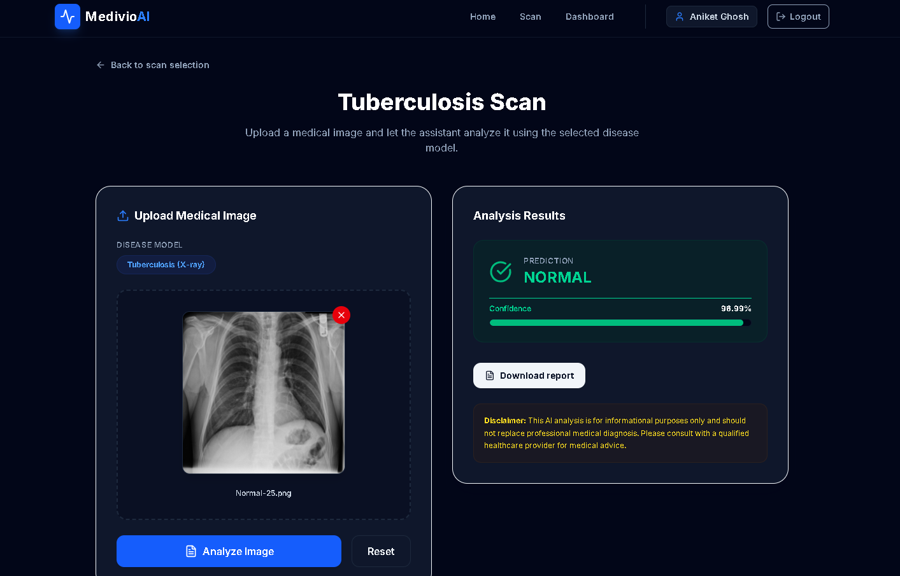

# 🩺 Medivio AI — AI-Powered Respiratory Disease Detection Platform

[](https://opensource.org/licenses/MIT)
[](https://www.python.org/)
[](https://react.dev/)
[](https://tensorflow.org/)
[](https://render.com/)
[](https://vercel.com/)

An intelligent healthcare web application designed to assist medical practitioners and radiologists in the early detection and screening of respiratory conditions—specifically **Pneumonia** and **Tuberculosis**—directly from Chest X-ray (CXR) images.

---

## 📖 Table of Contents

- [Overview](#-overview)
- [Key Features](#-key-features)
- [System Architecture](#-system-architecture)
- [Tech Stack](#-tech-stack)
- [Project Folder Structure](#-project-folder-structure)
- [Environment Variables](#-environment-variables)
- [Installation & Setup](#-installation--setup)
- [API Endpoints](#-api-endpoints)
- [AI Model Pipeline & Workflow](#-ai-model-pipeline--workflow)
- [Deployment Guide](#-deployment-guide)
- [Screenshots](#-screenshots)
- [Future Enhancements](#-future-enhancements)
- [Challenges & Learnings](#-challenges--learnings)
- [Contributing](#-contributing)
- [License](#-license)
- [Contact](#-contact)

---

## 🔍 Overview

Late or inaccurate diagnosis of respiratory illnesses like Pneumonia and Tuberculosis leads to thousands of preventable deaths annually. **Medivio AI** bridges this gap by leveraging state-of-the-art Deep Learning (Convolutional Neural Networks) to analyze Chest X-rays in real-time. 

To maximize operational efficiency and keep running costs at zero:
* The **Frontend** React app is served via Vercel Edge networks.
* The **Flask API Service** runs on Render's free compute tier.
* The memory-intensive **TensorFlow Models** are offloaded to **Hugging Face Spaces (Inference API)**, bypassing Render's 512MB RAM constraints by utilizing Hugging Face's free 16GB RAM container environment.

---

## ✨ Key Features

*   **Dual-Disease Classification:** Dedicated deep learning models for Pneumonia and Tuberculosis.
*   **Instant Radiograph Analysis:** Submit a Chest X-ray image and get predictions under 3 seconds.
*   **Probability & Confidence Mapping:** Yields class probabilities for both the disease and normal states.
*   **Secure Authentication Engine:** Fully implemented JWT-based user sign-up, login, and profile tracking.
*   **Medical History Dashboard:** Retains historical patient diagnostics records linked to user accounts.
*   **Interactive Visual Analytics:** Sleek history log accompanied by base64-encoded thumbnail previews of uploaded radiographs.
*   **Fully Responsive UI/UX:** Styled using modern, responsive components suitable for desktop, tablets, and mobile screens.

---

## 🏗️ System Architecture

```text
┌─────────────────┐       HTTPS       ┌──────────────────┐       HTTPS       ┌───────────────────┐
│                 ├──────────────────>│                  ├──────────────────>│                   │
│   Web Browser   │                   │  Flask API Gateway │                   │  Hugging Face     │
│  (React/Vite)   │<──────────────────┤    (Render)      │<──────────────────┤  Space Docker API │
│                 │   JSON Response   │                  │   JSON Response   │ (TensorFlow Host) │
└────────┬────────┘                   └────────┬─────────┘                   └─────────┬─────────┘
         │                                     │                                       │
         ▼ (Hosted on Vercel)                  ▼ (MongoDB Atlas Cloud)                 ▼ (16GB RAM)
 ┌───────────────┐                    ┌──────────────────┐                    ┌──────────────────┐
 │ Vercel Server │                    │  MongoDB Cluster │                    │  Keras Models    │
 └───────────────┘                    └──────────────────┘                    └──────────────────┘
```

---

## 🛠️ Tech Stack

| Layer | Technology / Tool | Purpose |
| :--- | :--- | :--- |
| **Frontend** | ReactJS + Vite + TailwindCSS | Fast, reactive SPA UI with premium modern styling |
| **Backend** | Python + Flask + Gunicorn | API Gateway, Route Controller, JWT Authentication |
| **Database** | MongoDB Atlas (Cloud) | Multi-tenant patient record persistence and user auth |
| **AI Models** | TensorFlow, Keras, PIL, NumPy | Convolutional Neural Network (CNN) Deep Learning |
| **Model Hosting** | Hugging Face Spaces (Docker) | High-performance inference host (16GB RAM tier) |
| **Hosting (Web)** | Vercel (Frontend) + Render (Backend) | Globally distributed web hosting with automated CD |

---

## 📁 Project Folder Structure

```text
MedivioAI/
├── backend/
│   ├── auth.py              # JWT authentication utility helper functions
│   ├── db.py                # Database connection initializing MongoDB Atlas
│   ├── app.py               # Flask Application (Entry point & API Gateway)
│   ├── requirements.txt     # Backend runtime dependencies
│   └── models/              # Local copies of models (used for fallback or training)
│       ├── pneumonia/
│       └── tuberculosis/
├── frontend/
│   ├── src/                 # React source code components, pages & assets
│   ├── public/              # Static public assets
│   ├── package.json         # Node dependencies and scripts
│   ├── vite.config.js       # Vite build configurations and local reverse proxies
│   └── vercel.json          # Vercel configuration for SPA page refreshes
└── README.md                # Project documentation
```

---

## 🔑 Environment Variables

### Backend (`backend/.env`)
```env
MONGO_URI=mongodb+srv://<db_user>:<password>@cluster.mongodb.net/medivioai
JWT_SECRET=your_jwt_signature_secret_key
```

### Frontend (`frontend/.env`)
```env
VITE_API_URL=https://your-backend-onrender.com
```

---

## 🚀 Installation & Setup

### Prerequisites
*   [Node.js](https://nodejs.org/) (v18.x or later)
*   [Python](https://www.python.org/) (v3.9 or v3.10)
*   [MongoDB Atlas](https://www.mongodb.com/) Account

### 1. Backend Setup
```bash
cd backend
python -m venv .venv
# On Windows:
.\.venv\Scripts\activate
# On Linux/macOS:
source .venv/bin/activate

pip install -r requirements.txt
python app.py
```
*The local backend API will start on `http://localhost:5000`.*

### 2. Frontend Setup
```bash
cd ../frontend
npm install
npm run dev
```
*The local development server will start on `http://localhost:3000`.*

---

## 🔌 API Endpoints

All requests should be sent to the backend base URL (e.g. `https://your-backend.onrender.com/api`).

| Method | Endpoint | Access | Description |
| :--- | :--- | :--- | :--- |
| **GET** | `/health` | Public | Check backend operational status |
| **POST** | `/auth/register` | Public | Create new user account |
| **POST** | `/auth/login` | Public | Sign in and retrieve JWT token |
| **GET** | `/auth/profile` | Authenticated | Retrieve profile details of logged-in user |
| **GET** | `/records` | Authenticated | Get all previous analysis history for the user |
| **POST** | `/predict` | Public/Auth | Upload a Chest X-ray image for diagnosis |

---

## 🧠 AI Model Pipeline & Workflow

1. **User Action:** Image uploaded through the web client -> sent to Flask Backend `/predict`.
2. **Gateway Route:** Flask receives the file, reads raw bytes, and routes them to the Hugging Face Space Inference Endpoint.
3. **Inference Container:**
   - Image is preprocessed (`224x224` resolution, RGB channels, normalisation `/ 255.0`).
   - Fed into the selected model (`tuberculosis` or `pneumonia`).
   - Predictions are computed by the CNN.
4. **Classification logic:**
   - Probability `> 0.5` flags a Positive diagnosis (`PNEUMONIA` or `TUBERCULOSIS`).
   - Probability `<= 0.5` flags a `NORMAL` diagnosis.
5. **Database Log:** If authenticated, a thumbnail is generated and the diagnostic record is logged into MongoDB.

---

## 🌐 Deployment Guide

### Step 1: Hugging Face Spaces (Model Server)
1. Go to [Hugging Face Spaces](https://huggingface.co/spaces) and click **Create Space**.
2. Select **Docker** SDK (choose the **Blank** template).
3. Upload your models and write a FastAPI inference handler (`app.py`), a `Dockerfile`, and a `requirements.txt` incorporating `tensorflow==2.16.1` and `keras==3.1.1`.
4. Grab the public app URL: `https://<username>-<space-name>.hf.space/predict`.

### Step 2: Render (Flask App Gateway)
1. Log in to [Render](https://render.com) and create a **Web Service** mapped to your Git repository.
2. Select the `backend` subdirectory as the root directory.
3. Configure the start command as `gunicorn app:app` and add environment variables (`MONGO_URI`, `JWT_SECRET`).
4. Set the backend instance tier to **Free**.

### Step 3: Vercel (React Client)
1. Log in to [Vercel](https://vercel.com) and import your repository.
2. Select `frontend` as the Root Directory.
3. Add Environment Variable `VITE_API_URL` pointing to your hosted Render URL.
4. Click **Deploy**.

---

## 🖼️ Screenshots

> [!NOTE]
> *Actual application interface mockups will be placed below.*

| Dashboard View | Upload & Analysis |
| :---: | :---: |
|  |  |

---

## 🔮 Future Enhancements

- [ ] **Grad-CAM Integration:** Visualizing the CNN heatmaps to highlight exactly which segments of the lung the AI focused on.
- [ ] **Multi-Label Classifiers:** Single pipeline to screen multiple respiratory diseases (COVID-19, Atelectasis, Cardiomegaly) simultaneously.
- [ ] **PDF Report Export:** Download formal, downloadable diagnostic summaries for doctors.
- [ ] **DICOM File Support:** Ingest medical-native `.dcm` image assets directly.

---

## 💡 Challenges & Learnings

*   **Memory Footprint Optimization:** Offloading the Keras models to Hugging Face solved server crashing on Render's 512MB RAM tier, demonstrating standard cloud architecture practices (decoupling API routing from high-performance computation).
*   **Version Serialization:** Fixed critical deserialization errors caused by Keras 3 architecture differences (such as `batch_shape` mismatch exceptions) by aligning Keras/TensorFlow requirements in the HF Docker container.

---

## 🤝 Contributing

Contributions make the open-source community an amazing place to learn, inspire, and create.
1. Fork the Project.
2. Create your Feature Branch (`git checkout -b feature/AmazingFeature`).
3. Commit your Changes (`git commit -m 'Add some AmazingFeature'`).
4. Push to the Branch (`git push origin feature/AmazingFeature`).
5. Open a Pull Request.

---

## 📄 License

Distributed under the MIT License. See `LICENSE` for more details.

---

## ✉️ Contact & Support

**Aniket Ghosh** - [@aniketghoshcoder](https://github.com/Aniketghosh2003) - ghoshaniket00000@gmail.com  
Project Link: [https://github.com/Aniketghosh2003/Final-year-project_MedivioAI](https://github.com/Aniketghosh2003/Final-year-project_MedivioAI)
